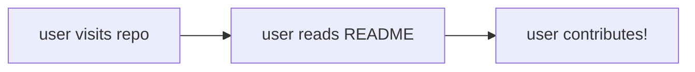

# Example Open Source Repo

This is an example repository to illustrate different facets of documentation and the anatomy of an open source repo.  Find example README.md files and other README-related resources towards [the bottom of this file](#example-readmes-and-other-resources).

Note that this repo can also be used as [a template](https://docs.github.com/en/repositories/creating-and-managing-repositories/creating-a-repository-from-a-template) to create your own repository.

## Examples in this repo:
- Community Health Files
    - [LICENSE.md](./LICENSE.md)
    - [CONTRIBUTING.md](./CONTRIBUTING.md)
    - [SUPPORT.md](./SUPPORT.md)
    - [SECURITY.md](./SECURITY.md)
    - [CITATION.md](./CITATION.md)
- Workflows
    - Open API
        - [linting and bundling](./.github/workflows/lint-api-docs.yml)
        - [deploying to github Pages](./.github/workflows/deploy-api-docs.yml)
    - [Lint Workflows](./.github/workflows/lint-workflows.yml)
- [Issue Templates](./.github/ISSUE_TEMPLATE/)
- [Pull Request Templates](./.github/PULL_REQUEST_TEMPLATE/)
- OpenAPI
    - the OpenAPI examples in this repo were generated using Redocly's [create-openapi-repo](https://github.com/Redocly/create-openapi-repo)

## Community Health Files

GitHub allows people viewing your repository to easily access certain Community Health Files via the sidebar if they exist at the root level of your directory: 


---

## About READMEs
The README is the first thing a new contributor sees or reads when they encounter your project. It should contain an overview of your project and link to other places to learn about the project itself, its maintainers, and how contribution works. 

### Make it pretty
This file has the `.md` extension, which means we can write using [Markdown](https://docs.github.com/en/get-started/writing-on-github/getting-started-with-writing-and-formatting-on-github/basic-writing-and-formatting-syntax), a special syntax for formatting our text.  You should utilize Markdown to organize, emphasize, and link to different parts of your documentation.  Markdown even has some [advanced features](https://docs.github.com/en/get-started/writing-on-github/working-with-advanced-formatting), like flow charts:



Since we're using Markdown and you're viewing this file on GitHub :octocat:, using headings (denoted with `#`) will automatically generate a table of contents for the README.md that exists at the root of your repository.


### Example READMEs and Other Resources
- https://github.com/18F/open-source-guide/blob/18f-pages/pages/making-readmes-readable.md 
- https://github.com/matiassingers/awesome-readme
- [GitHub Docs: About READMEs](https://docs.github.com/en/repositories/managing-your-repositorys-settings-and-features/customizing-your-repository/about-readmes)


The following is from [@PurpleBooth's Example README](https://gist.github.com/PurpleBooth/109311bb0361f32d87a2)

---

# Project Title

One Paragraph of project description goes here

## Getting Started

These instructions will get you a copy of the project up and running on your local machine for development and testing purposes. See deployment for notes on how to deploy the project on a live system.

### Prerequisites

What things you need to install the software and how to install them

```
Give examples
```

### Installing

A step by step series of examples that tell you how to get a development env running

Say what the step will be

```
Give the example
```

And repeat

```
until finished
```

End with an example of getting some data out of the system or using it for a little demo

## Running the tests

Explain how to run the automated tests for this system

### Break down into end to end tests

Explain what these tests test and why

```
Give an example
```

### And coding style tests

Explain what these tests test and why

```
Give an example
```

## Deployment

Add additional notes about how to deploy this on a live system

## Built With

Links to technologies your project relies on

## Contributing

Please read [CONTRIBUTING.md](./CONTRIBUTING.md) for details on our code of conduct, and the process for submitting pull requests to us.

## Versioning

We use [SemVer](http://semver.org/) for versioning. For the versions available, see the [tags on this repository](https://github.com/your/project/tags). 

## Authors

* **Billie Thompson** - *Initial work* - [PurpleBooth](https://github.com/PurpleBooth)

See also the list of [contributors](https://github.com/your/project/contributors) who participated in this project.

## License

This project is licensed under the MIT License - see the [LICENSE.md](LICENSE.md) file for details

## Acknowledgments

* Hat tip to anyone whose code was used
* Inspiration
* etc
